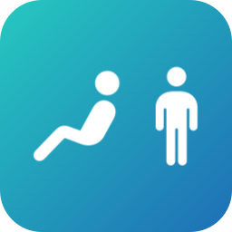
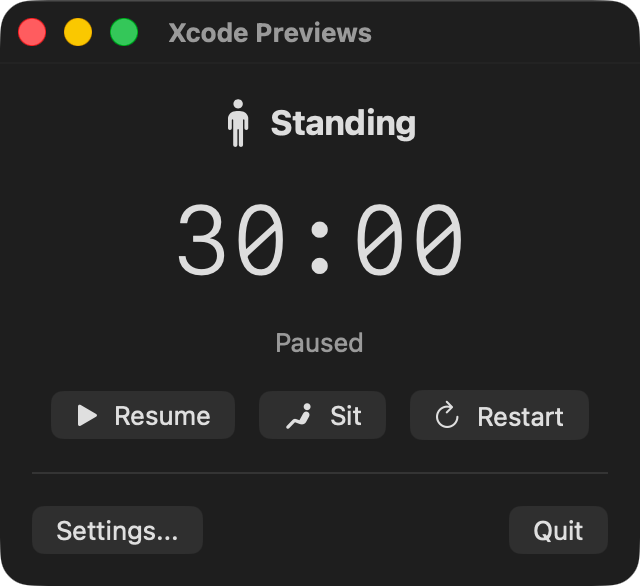
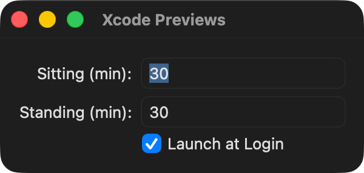

<p align="center">
  
</p>

# Sitter

A macOS menu bar app for alternating between sitting and standing at a standing desk. Helps avoid fatigue and over-sitting with configurable timers and notifications.

## Features

- Timer countdown displayed in the menu bar with sit/stand icon
- Configurable sitting and standing durations (default 30 minutes each)
- Local notifications with sound when a session ends
- Auto-pauses when your Mac is locked, asleep, or screensaver is active
- Resume/Pause, Switch position, and Restart controls
- Launch at login support
- No Dock icon -- lives entirely in the menu bar

## Screenshots

| Popover | Settings |
|---------|----------|
|  |  |

## Install

```sh
brew tap oronbz/tap && brew install --cask sitter
```

Or download `Sitter.zip` from the [latest release](https://github.com/oronbz/Sitter/releases/latest), unzip, and move `Sitter.app` to `/Applications`.

## Update

```sh
brew update && brew upgrade --cask sitter
```

## Requirements

- macOS 15.0 (Sequoia) or later

## Building from Source

1. Clone the repo
2. Open `Sitter.xcodeproj` in Xcode
3. Build and run (Cmd+R)

## Releasing a New Version

```sh
make release VERSION=1.0.0
```

This bumps the version, commits, builds a Release archive, creates a GitHub release with the zip attached, and updates the Homebrew tap cask with the new sha256. Omit `VERSION=` to be prompted interactively.
